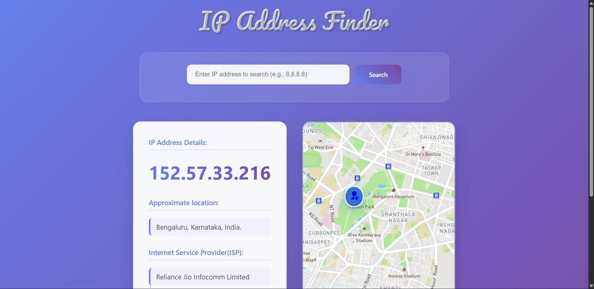
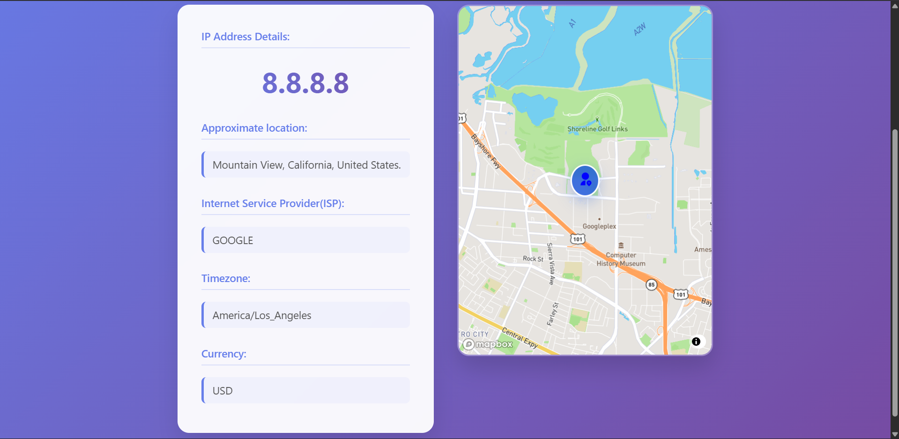

# IP Address Finder

A full-stack application for looking up IP address information with a React frontend and Express backend. The application displays geographical information about IP addresses on an interactive map.

## Features

- **Backend Proxy with API Key Protection**: Express.js backend that securely handles API calls
- **Rate Limiting & Caching**: Prevents excessive API calls and improves performance
- **Saved Searches**: Save and manage your favorite IP lookups
- **Input Validation**: Validates IPv4 and IPv6 formats
- **Error Handling**: Comprehensive error handling with user-friendly messages
- **Interactive Map**: Visualize IP locations on a map
- **Unit Tests**: Comprehensive test suite for components and services

## Project Structure

```
├── client/            # React frontend
│   ├── src/
│   │   ├── components/  # React components
│   │   ├── test/        # Unit tests
│   │   └── App.jsx      # Main application component
│   └── package.json
│
└── server/            # Express backend
    ├── index.js         # Server entry point
    └── package.json
```

## Setup & Installation

### Prerequisites

- Node.js (v14 or higher)
- npm or yarn

### Backend Setup

1. Navigate to the server directory:
   ```
   cd server
   ```

2. Install dependencies:
   ```
   npm install
   ```

3. Create a `.env` file based on `.env.example` and add your API keys:
   ```
   IPAPI_KEY=your_ipapi_key_here
   IPINFO_TOKEN=your_ipinfo_token_here
   ```

4. Start the server:
   ```
   npm run dev
   ```
   The server will run on http://localhost:3001

### Frontend Setup

1. From the project root, install dependencies:
   ```
   npm install
   ```

2. Create a `.env` file based on `.env.example` and add your Mapbox API key:
   ```
   VITE_MAPBOX_API_KEY=your_mapbox_api_key_here
   ```

3. Start the development server:
   ```
   npm run dev
   ```
   The application will be available at http://localhost:5173

## Running Tests

Run the test suite with:

```
npm test
```

For watch mode during development:

```
npm run test:watch
```

For test coverage report:

```
npm run test:coverage
```

## API Endpoints

### GET `/api/lookup/:ip?`

Looks up IP information using ipapi.co.

- If `:ip` is provided, it looks up that specific IP address
- If `:ip` is omitted, it looks up the client's IP address

### GET `/api/lookup-alt/:ip?`

Alternative IP lookup using ipinfo.io.

## Technologies Used

- **Frontend**: React, Axios, Mapbox GL
- **Backend**: Node.js, Express
- **Testing**: Vitest, React Testing Library
- **Caching**: Node-Cache
- **Styling**: CSS with responsive design

A modern, responsive web application that allows users to search for IP addresses and view detailed information including geographical location, ISP details, timezone, and currency. The app features an interactive map display powered by Mapbox to visualize the location of any IP address.

## ✨ Features

- **IP Address Lookup**: Search for any IP address to get detailed information
- **Geographical Information**: Display city, region, and country information
- **ISP Details**: Show Internet Service Provider information
- **Timezone & Currency**: Display local timezone and currency information
- **Interactive Map**: Visual representation of the IP address location using Mapbox
- **Real-time Search**: Instant results with loading states and error handling
- **Responsive Design**: Modern UI that works on desktop and mobile devices
- **Auto-detection**: Automatically detects and displays your current IP address on page load

## 🖼️ Screenshots



### Main Interface
The application features a clean, modern design with a purple gradient background. Users can enter any IP address in the search bar and get comprehensive information displayed in two main panels:

**Left Panel - IP Address Details:**
- Prominent display of the IP address (e.g., "8.8.8.8")
- Approximate location (e.g., "Mountain View, California, United States.")
- Internet Service Provider (e.g., "GOOGLE")
- Timezone information (e.g., "America/Los_Angeles")
- Local currency (e.g., "USD")

**Right Panel - Interactive Map:**
- Detailed map view powered by Mapbox
- Blue location marker indicating the exact IP address location
- Street-level view with landmarks, parks, and neighborhoods
- Points of interest including parks, stadiums, and cultural sites

## 🚀 Installation

### Prerequisites
- Node.js (version 16 or higher)
- npm or yarn package manager

### Setup Instructions

1. **Clone the repository**
   ```bash
   git clone https://github.com/rahul-a-22/IP_Adress_Finder.git
   cd IP_Adress_Finder
   ```

2. **Install dependencies**
   ```bash
   npm install
   ```

3. **Set up environment variables**
   Create a `.env` file in the root directory and add your Mapbox access token:
   ```env
   VITE_MAPBOX_ACCESS_TOKEN=your_mapbox_access_token_here
   ```
   
   > **Note**: You'll need to sign up for a free Mapbox account at [mapbox.com](https://mapbox.com) to get an access token.

4. **Start the development server**
   ```bash
   npm run dev
   ```

5. **Open your browser**
   Navigate to `http://localhost:5173` to view the application

## 🛠️ Available Scripts

- `npm run dev` - Start development server with hot reload
- `npm run build` - Build the project for production
- `npm run preview` - Preview the production build locally
- `npm run lint` - Run ESLint to check code quality

## 🏗️ Project Structure

```
IP_Adress_Finder/
├── public/                 # Static assets
├── src/
│   ├── components/         # React components
│   │   └── map.jsx        # Map component using Mapbox
│   ├── assets/            # Images and other assets
│   ├── App.jsx            # Main application component
│   ├── App.css            # Application styles
│   ├── index.css          # Global styles
│   └── main.jsx           # Application entry point
├── package.json            # Dependencies and scripts
├── vite.config.js         # Vite configuration
└── README.md              # This file
```

## 🔧 Technologies Used

- **Frontend Framework**: React 19
- **Build Tool**: Vite
- **Styling**: CSS3 with modern design principles
- **HTTP Client**: Axios for API requests
- **Mapping**: Mapbox GL JS for interactive maps
- **Icons**: React Icons
- **Development**: ESLint for code quality

## 📡 API Integration

The application uses the [ipapi.co](https://ipapi.co) service to fetch IP address information. This service provides:
- IP address details
- Geographical location (city, region, country)
- ISP information
- Timezone data
- Currency information
- Latitude and longitude coordinates

## 🎯 Usage

1. **View Current IP**: The app automatically displays your current IP address information when you first load the page
2. **Search for IP**: Enter any IP address in the search bar (e.g., 8.8.8.8 for Google's DNS)
3. **View Results**: See detailed information displayed in the left panel and location on the interactive map
4. **Interactive Map**: Use the map to explore the area around the IP address location

## 🌍 Supported IP Addresses

The application supports:
- IPv4 addresses (e.g., 192.168.1.1)
- IPv6 addresses
- Public and private IP addresses
- Any valid IP address format

## 🚧 Error Handling

The application includes comprehensive error handling:
- Invalid IP address format detection
- Network error handling
- Loading states for better user experience
- Clear error messages for troubleshooting

## 📱 Responsive Design

The application is fully responsive and works seamlessly on:
- Desktop computers
- Tablets
- Mobile devices
- Various screen sizes and orientations

## 🤝 Contributing

Contributions are welcome! Please feel free to submit issues, feature requests, or pull requests.


## 🙏 Acknowledgments

- [ipapi.co](https://ipapi.co) for providing IP address information
- [Mapbox](https://mapbox.com) for mapping services
- React team for the amazing framework
- Vite team for the fast build tool

---

**Happy IP Address Finding! 🌐📍**
